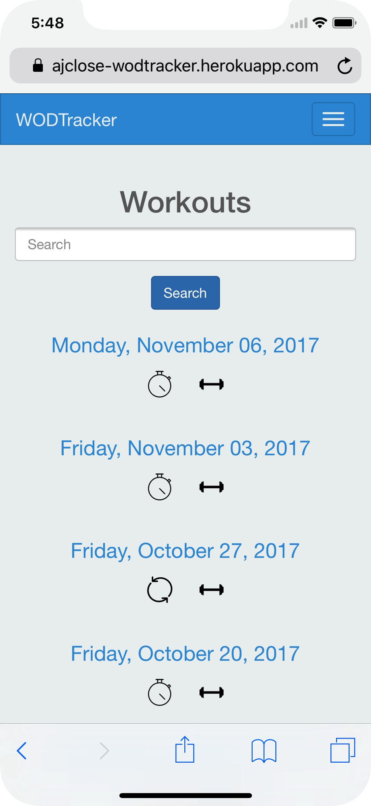
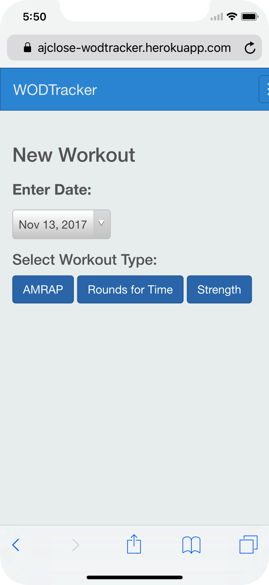
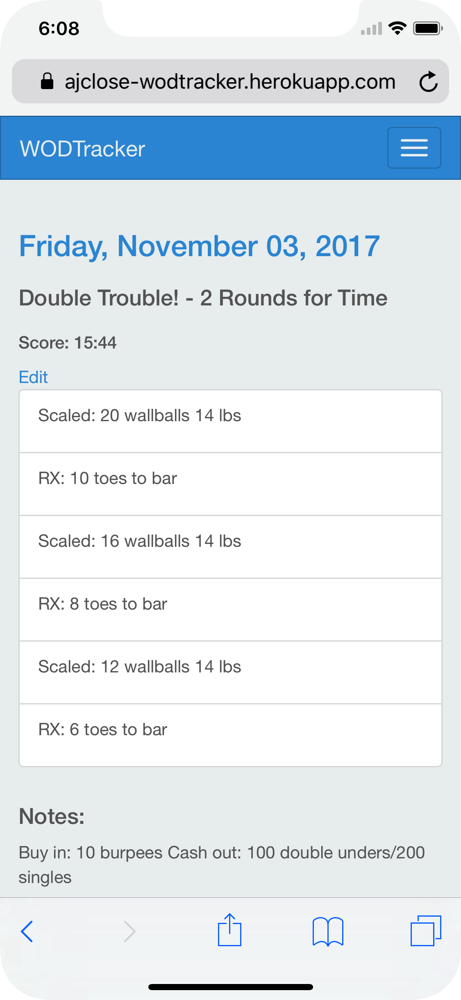
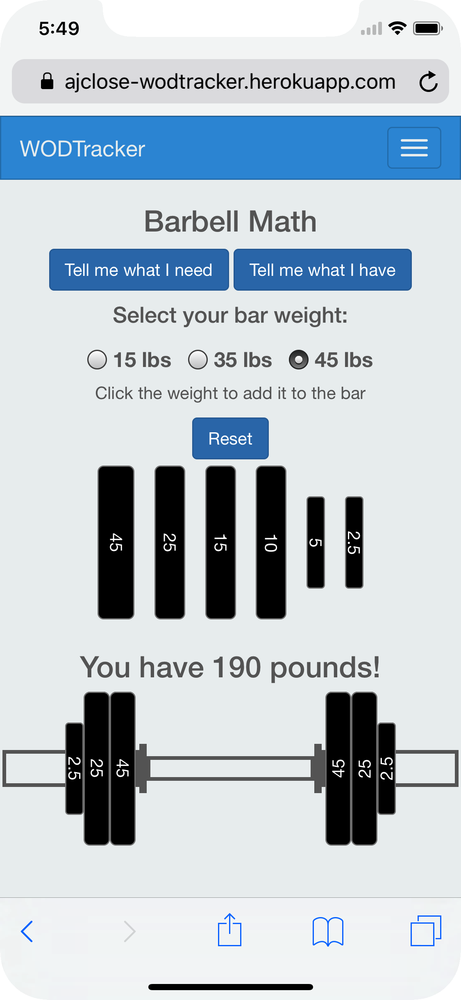
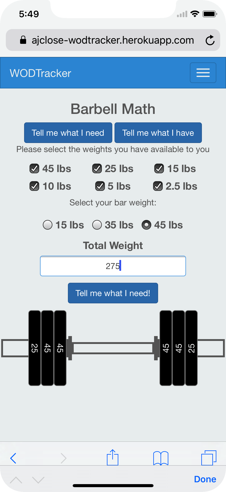

# WODTracker

### WODTracker is an app that allows you to simply track crossfit style workouts.  Choose from 3 different types of workouts: AMRAP, Rounds for Time, and Strength.  
### WODTracker also includes a barbell calculator that does the heavy lifting for you so your brain doesn't have to.  The barbell calculator has 2 options: Tell me what I need and Tell me what I have.

### WODTracker is mobile responsive so you can quickly and easily log your workouts at the gym from your phone.

#### Home Screen

#### New Workout

#### Show Workout

#### Tell me what I have

#### Tell me what I need

